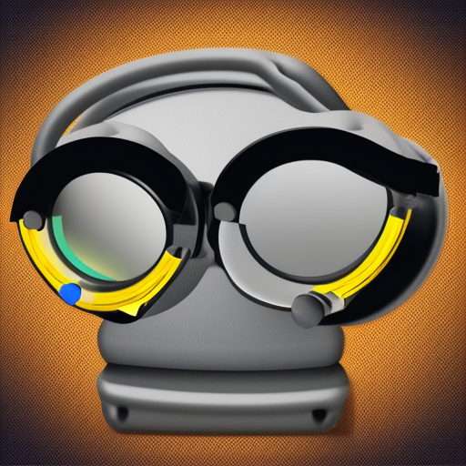

# Apnea Training Timer

A minimal Android app written in Java to perform apnea training exercises with a sequence of timed breaths and holds from the CO2 or O2 static table.

## Usage

- Select either the [CO2 or O2 static table protocol](https://visitsithonia.com/lifestyle/sport/freediving-static-tables/)
- Set your maximum breath holding time to calibrate the protocol 
- Start the timer, which will automatically cycles through 8 rounds of timed breathing and holding sequences

**_IMPORTANT NOTE: if not done properly, this activity poses health risks that should not be underestimated. For safety reasons never exceed the times recommended by the protocol, never perform these excercises more than once per day, and if possible never practice without the company of another person who is aware of it and can be of assistance if needed._**

## Installation

Navigate to /app/release/ and copy the app-release.apk to your android device. Tap on it to start the installation. 

## Contributing

If you find a bug or would like to suggest a feature, let me know by opening an issue on this repository. Pull requests are welcome!

## License
This project is licensed under the MIT License - see the LICENSE file for details.
